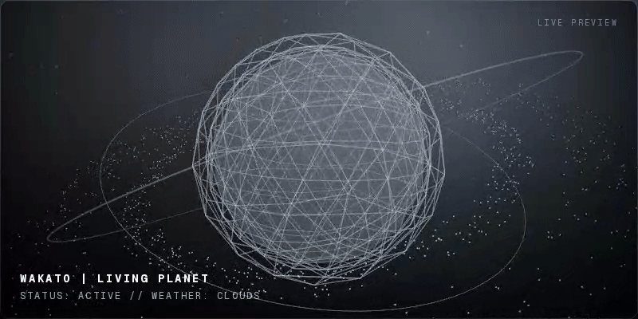

<div align="center">
  <a href="https://wakato.tech">
    
  </a>
</div>

# 🌍 WAKATO | Living Planet Portfolio

<div align="center">
  
  
  
  
</div>


<br />

<div align="center">
  <h2>"Where Code Breathes with the Atmosphere."</h2>
  <p>
    開発者の<b>「活動の軌跡」</b>が大地となり、現実世界の<b>「空気」</b>が空を染める。<br/>
    静的なポートフォリオを、有機的な「惑星」へと昇華させる実験的プロジェクト。
  </p>
</div>

---

# 🏆 Awards

**[CSS Winner](https://www.csswinner.com/details/wakato-3d-portfolio/19159)**
- **Site of the Day (SOTD)** - 2026/04/08


# 🧬 Concept: Fusion of Two Origins

このプロジェクトは、過去に開発された2つの代表作のコンセプトを融合し、  
最新のWeb技術で再構築した **「技術と表現の集大成」** です。

## 01. Structural DNA from GitHub Planet

> **"Code as Terrain"**

開発者のGitHub活動履歴（Contributions）を解析し、  
3D空間上の惑星として可視化。

---

## 02. Atmospheric DNA from Otenki Gurashi

> **"Life synced with Weather"**

現実の気象と連動し、  
空間内の天候（雨・光・夜）を変化させます。

---

<div align="center">
  <h3>GitHub Planet × Otenki Gurashi = <b>Wakato Portfolio</b></h3>
</div>

---

# ✨ Features

## 🪐 Living Planet Core
GLSLにより「呼吸する惑星」を表現。

## 🌦️ Immersive Weather System
天気APIと連動した環境変化。

## ⚡ Next-Gen Performance
RSC・GPU最適化で高速描画。

---

# 🛠 Tech Stack

| Domain    | Technology                | Role                        |
| --------- | ------------------------ | --------------------------- |
| Framework | Next.js 16               | App Router                  |
| Language  | TypeScript               | Strict Mode                 |
| 3D Engine | React Three Fiber        | 3D Scene                    |
| Shaders   | GLSL                     | Displacement                |
| Styling   | Tailwind CSS v4          | UI                          |
| Animation | Framer Motion / Anime.js | Motion                      |
| State     | Zustand                  | Global State                |

---

# 📂 Architecture

```bash
src/
├── app/
├── components/
│   ├── canvas/
│   │   ├── Planet.tsx
│   │   ├── Weather.tsx
│   │   └── Scene.tsx
│   └── dom/
├── lib/
│   └── actions.ts
├── shaders/
└── store/
```

---

# 🚀 Getting Started

```bash
# Clone
git clone https://github.com/nitr0yukkuri/wakatopo.git

# Install
npm install

# Env (optional: GA4)
# .env.local を作成して設定
# NEXT_PUBLIC_GA_MEASUREMENT_ID=G-XXXXXXXXXX

# Run
npm run dev
```

Open: http://localhost:3000

---

# 季節の隠しエフェクト

春・夏・秋・冬に応じて、惑星の空気感が静かに変化する隠しビジュアルエフェクトを追加しています。

---

# 🔮 Roadmap

- [ ] Mobile Gyro（スマホ傾きパララックス）

---

<div align="center">

Built with 
by nitr0yukkuri  

"This portfolio is a living organism."

</div>
